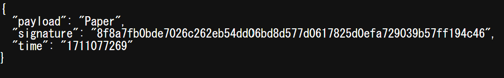

# - rps
### **This api provides Rock Paper Scissors game.**
### Flask, Nginx, uWSGI on Docker container.

- payload: There are three types ["Rock", "Paper", "Sciserors"]
- signeture: The signature is generated using SHA256 hash function, combining time, payload, and key inputs, ensuring data integrity and authenticity.  
`hashlib.sha256((time + payload + key).encode()).hexdigest()`
- time: Number of seconds elapsed since UNIX epoch.